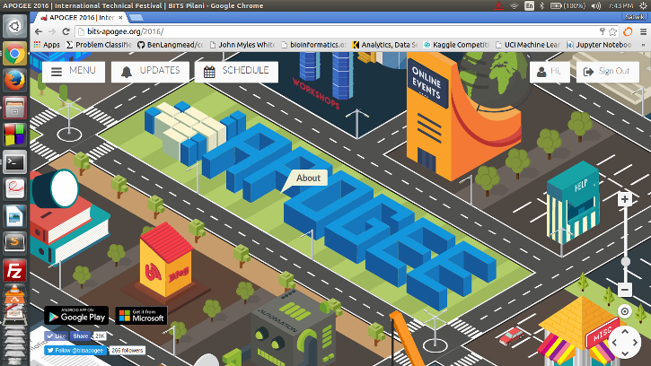
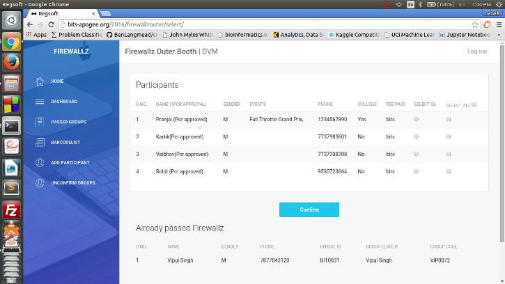
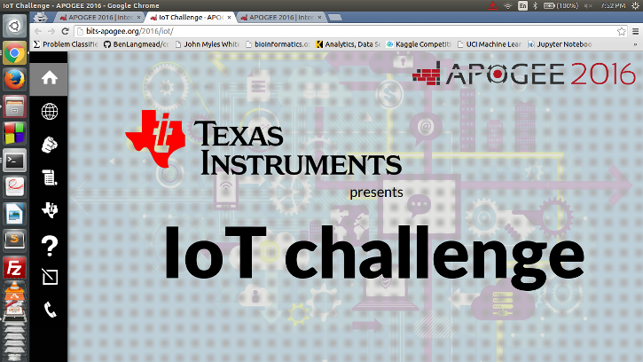
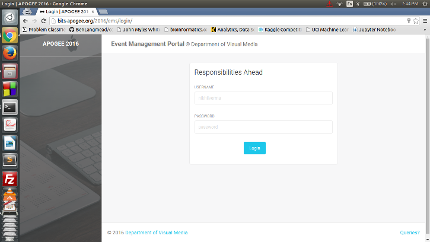

# Apogee 2016 | DVM

###Official repository of bits-apogee.org

Main Site:  
  
  
Registration Software:  
  

Internet of Things:  
  

Event Management Portal:  
  

###Links for Websites:

Apogee main: http://bits-apogee.org/2016/   
Apogee Intro: http://bits-apogee.org/2016/intro/   
Lacuna : http://bits-apogee.org/2016/lacuna/   
IOT : http://bits-apogee.org/2016/iot/   
Aarohan : http://bits-apogee.org/2016/aarohan/   
Apogee innovation challenge: http://bits-apogee.org/2016/aic/   
Event management system : http://bits-apogee.org/2016/ems/   
Registration Software : http://bits-apogee.org/2016/controlz/home/   
Reverse Engineering Quiz: http://bits-apogee.org/2016/reveng/   